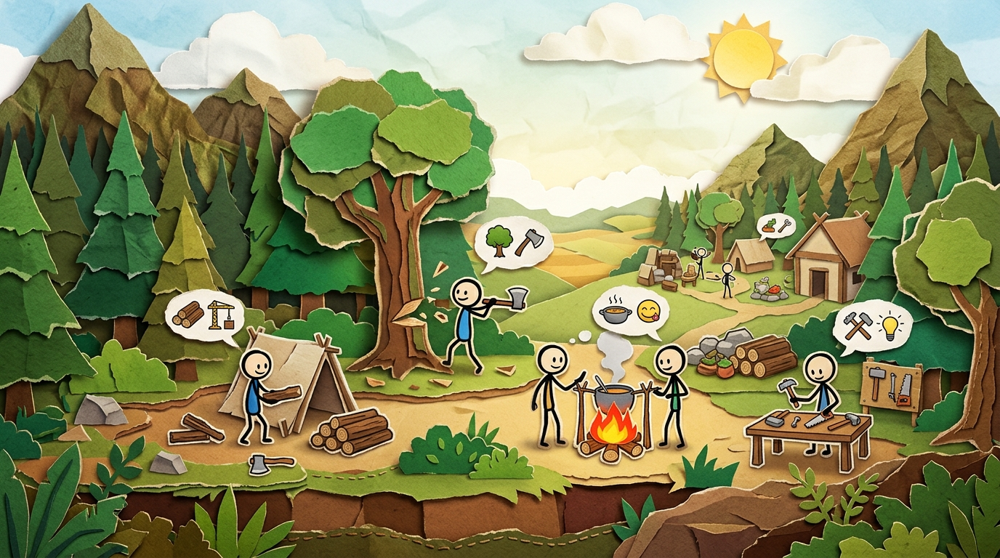

<div align="center">

# ✂️ SNIPWARFARE 🪵
### *Ein Papierschnitt-Kolonie- und RTS-Spektakel aus den Augen von Shinon*


<br/>

[](https://godotengine.org)
[-2ea44f?style=for-the-badge&logo=githubactions&logoColor=white)
[](#-versionierung-eine-zahl-f%C3%BCr-alle-dokumente)](#-der-gnadenlose-preflight-shinons-t%C3%BCv)
[](#-der-gnadenlose-preflight-shinons-t%C3%BCv)
[-8a2be2?style=for-the-badge)](#-der-gnadenlose-preflight-shinons-t%C3%BCv)
[](#-die-architektur-pyramide)

<br/>

<p align="center">
  
  &nbsp;&nbsp;&nbsp;&nbsp;
  
  &nbsp;&nbsp;&nbsp;&nbsp;
  
  &nbsp;&nbsp;&nbsp;&nbsp;
  
  &nbsp;&nbsp;&nbsp;&nbsp;
  
</p>

> **"Hallo du. Ich bin Shinon. Ich halte dieses handgeschnittene Papier-Lager zusammen, solange du hier zuschaust. Du liest das nicht, weil die Engine dich lieb hat. Du liest es, weil ich das Chaos gebändigt habe, bevor es deine Kolonie zerreißt."**

</div>

---

## 🎭 Shinon bricht die 4. Wand: Willkommen im Papier-Überlebenskampf!

Schau dich um. Du siehst diese niedlichen kleinen Strichmännchen mit ihren bunten Schals, die friedlich durch eine handgefertigte Papierschnitt-Welt watscheln, Beeren pflücken und am Lagerfeuer sitzen. Du denkst: *„Ach wie putzig, ein gemütliches Bastelspiel!“*

**Täusch dich nicht.** 

Hinter jeder Papierschicht arbeitet ein knallharter, deterministischer Simulationskern. Wenn du vergisst, Unterkünfte zu bauen, frieren deine Siedler. Wenn du keine Nahrung einlagerst, brennt die Stimmung lichterloh. Und wenn der Hunger zu groß wird, fängt die Mood-Maschine an, sehr finstere Gedankenblasen über die Köpfe zu malen.

> [!TIP]
> ### ☕ Shinon kann auch nett sein *(aber gewöhn dich bloß nicht dran!)*
> *„Ganz ehrlich? Wenn du deine Kolonisten vernünftig fütterst, die Werkstatt rechtzeitig anschmeißt und der Preflight fehlerfrei durchläuft... dann bin ich sogar richtig stolz auf dich. Dann setz ich mich mit dir ans Lagerfeuer, reich dir ein geräuchertes Stück Fleisch und nicke anerkennend. Aber wehe, du vergisst die Wintervorräte. Dann bin ich wieder da.“*

---

<div align="center">

</div>

---

## 📂 Die 4 Säulen des Spiels (Kategorien)

### 🪵 Kategorie 1: Die Knechterei (Ressourcen & Handwerk)
Hier fällt kein Baum von alleine um. Deine Kolonisten greifen zur Axt, schlagen Holz, brechen Steine und schleppen das Material ins Lager.
* **Keine Zauberei:** Jede Erntezeit (`harvest_zeit_ticks`) errechnet sich aus dem Basisfaktor der `Kern_LogikRegistry` geteilt durch den Werkzeug-Bonus.
* **Echte Werkzeuge:** Mit einer geschmiedeten Axt halbiert sich die Hackdauer. Ohne Werkzeug schwitzen die Strichmännchen doppelt so lang.

### 🐻 Kategorie 2: Die Tierwelt (Zwischen Beute & Bärenhunger)
Der Wald lebt. Vögel flattern auf, Hasen ergreifen im Zickzack die Flucht und der Bär verteidigt sein Revier mit Nachdruck.
* **Jagd & Kadaver:** Erlegte Tiere bleiben als Kadaver liegen und müssen vom Jäger zerlegt werden, bevor das Fleisch ins Lager wandert.
* **Respekt vor dem Pelz:** Greifst du einen Bären mit bloßen Händen an, landet dein Jäger schneller im Lazarett, als du „Preflight“ sagen kannst.

### 🏗️ Kategorie 3: Die Baustellen (Warum nichts vom Himmel fällt)
Wir bauen nach echter Kolonie-Logik:
* **Blueprint-Planung:** Ein Gebäude wird zuerst als transparenter Bauplan auf die Karte gesetzt.
* **Materialtransport:** Erst wenn Holz und Stein aus dem nächsten Lager zur Baustelle getragen wurden, rückt der Zimmermann an.
* **Stufen-Gating:** Das Lagerfeuer ist der Startanker. Das Haus lockt Einwanderer an. Die Werkstatt sichert Werkzeuge. Alles streng nach Stufen.

### 🧠 Kategorie 4: Die Kolonisten-Psyche (Needs, Mood & Moral)
Jeder Siedler besitzt ein eigenes Gehirn mit Bedürfnissen nach Wärme, Nahrung und Schlaf.
* **Sichtbare Gedanken:** Die Denkblasen erzählen dir genau, was den Siedlern fehlt – vom Kälte-Zittern bis zur Heißhunger-Panik.
* **Moralische Grundsätze:** Über Kolonie-Grundsätze und Traits (wie *"Mag kein Papier"*) kannst du Verzweiflungstaten wie Kannibalismus blockieren und Ersatzhandlungen erzwingen. Die Grundsätze liegen als Daten in [`world/data/moral_regeln.json`](world/data/moral_regeln.json), die Bindung an Tiere und Katzen in [`population/data/bindung.json`](population/data/bindung.json); die Verdrahtung in der Zielwahl steht als Slice 14 in der [`ROADMAP.md`](ROADMAP.md).

---

## ⏱️ Das Herzstück: Genau eine Weltuhr (24 Hz)

Im gesamten Projekt existiert **genau eine globale Weltzeit**. Keine Domäne, kein Node und keine State Machine besitzt eine eigene geheime Uhrzeit oder heimliche `_process`-Berechnungen.

* **24 Ticks pro Sekunde:** Das Autoload `Weltuhr` (`Kern_Weltuhr`) ist der gemeinsame Taktgeber aller Systeme.
* **Spiralenschutz:** Das Rahmen-Budget fängt Lastspitzen sauber ab.
* **Reine Übersetzung:** Alle Zeitberechnungen (`ticks_aus_faktor`, `ticks_aus_minuten`) laufen zentral über die Uhr.

---

## 🏛️ Die Architektur-Pyramide

SnipWarfare folgt einer kompromisslosen **Single-Source-of-Truth-Architektur**. Der Code ist die Wahrheit (Regel 0), und die Spieldaten wohnen deklarativ in JSON-Pools.

```text
  ┌────────────────────────────────────────────────────────┐
  │       JSON-Datenpools (res://*/data/*.json)           │  ◄── Deklarative Wahrheit aller Werte
  └──────────────────────────┬─────────────────────────────┘
                             │ lädt via script-Feld
  ┌──────────────────────────▼─────────────────────────────┐
  │         Registries & Datenklassen (Registry)           │  ◄── Typgeprüfte Instanziierung
  └──────────────────────────┬─────────────────────────────┘
                             │ steuert & mutiert
  ┌──────────────────────────▼─────────────────────────────┐
  │     Maschinen & Manager (24 Hz Weltuhr-Tick)          │  ◄── Reine Fach- und Verhaltenslogik
  └──────────────────────────┬─────────────────────────────┘
                             │ schreibt Zustand
  ┌──────────────────────────▼─────────────────────────────┐
  │          Welt_Model (Autoritativer Zustand)            │  ◄── Fliesenraster & Objektlisten
  └──────────────────────────┬─────────────────────────────┘
                             │ beobachten & spiegeln
  ┌──────────────────────────▼─────────────────────────────┐
  │        Renderer, HUD, Bau-Panel & Darsteller           │  ◄── Reine Präsentationsschicht
  └────────────────────────────────────────────────────────┘
```

---

## 🎮 Steuerung & Interaktion

Die Steuerung ist vollständig menschenlesbar in [`game/data/steuerung.json`](game/data/steuerung.json) definiert:

| Eingabe | Aktion | Auswirkung im Spiel |
|---|---|---|
| <kbd>W</kbd> <kbd>A</kbd> <kbd>S</kbd> <kbd>D</kbd> | **Kamera bewegen** | Sanftes Verschieben des Sichtfelds über das Gelände ohne Ruckler. |
| <kbd>Linksklick</kbd> | **Einzelauswahl** | Wählt einen Siedler oder ein Objekt; hebt die vorherige Auswahl auf. |
| <kbd>Links Halten & Ziehen</kbd> | **Rechteck-Massenwahl** | Wählt alle Kolonisten im gezogenen Rahmen (General-Modus). |
| <kbd>Rechtsklick</kbd> *(auf Ziel)* | **Direktbefehl** | Startet sofort Holzfällen, Steinmetzen, Jagen oder Marschieren. |
| <kbd>Rechtsklick</kbd> *(auf Boden)* | **Kontextmenü** | Öffnet zielgefilterte Aktionen mit Tooltip & Werkzeuganforderung. |
| <kbd>F3</kbd> | **Debug-Overlay** | Schaltet System- und Tier-Statistiken ein/aus. |

---

## 📦 Das Ressourcen-Netzwerk

Jede Ressource besitzt ihr eigenes SVG-Icon und eine dedizierte Datenklasse:

<div align="center">

| Holz | Stein | Fleisch | Beeren | Räucherfleisch | Werkzeug |
|:---:|:---:|:---:|:---:|:---:|:---:|
|  |  |  |  |  |  |
| `Holz` | `Stein` | `Fleisch` | `Beeren` | `Räucherfleisch` | `Werkzeug` |

</div>

---

## 🗺️ Aktueller Zustand & Master-Roadmap

Der aktuelle **Zustand** und **Stand** umfasst ein gehärtetes Fundament mit 227 Klassen, 11 Szenen, funktionierender A*-Wegplanung, multi-map-fähiger World-Expansion und 85 bestandenen Pytest-Prüfungen. Diese README ist Teil des Vertrags: Sie wird bei jedem Versionsbump mechanisch mitgezogen und beschreibt den echten Stand, nie einen Wunsch. Der maschinenlesbare Router ist [`INDEX.md`](INDEX.md) — Domänen-Tabelle, Zuständigkeiten, Abhängigkeits-Graph und auto-generiertes Klasseninventar (`python tools/index_generieren.py`).

Unsere konsolidierte **Vision** ist in der [`ROADMAP.md`](ROADMAP.md) nach Slices strukturiert:

* [x] **Phase 0 (Kern):** 24-Hz-Weltuhr, deterministischer RNG, Signalbus, Multi-Map-Savegames, A*-Pfadfinder.
* [x] **Phase P1 (Progression):** Datengetriebene Einstiegskette: *Lagerfeuer* ➔ *Erstes Haus* ➔ *Einwanderung*.
* [ ] **Slice 1 (Aufräumen & Gating):** Entkoppeltes Bau-Panel, Ziel-Tags im Katalog, saubere Statusleisten.
* [ ] **Slice 2 (Maßstab & Terrain):** 64px-Micro-Tiles, Terrain-Pool (`terrain.json`), Varianten-Blatt & Y-Sort-Tiefensortierung.
* [ ] **Slice 3 (Landschaft):** Deterministische Fluss- & Felsmassive-Generatoren, Erzadern, Ruinen & dichte Wälder.
* [ ] **Slice 4 (Weltkarte):** Makrokarte mit Fraktionsnetzwerk, minimaler Startbereich & sichtbare Landeplatzmarkierung.
* [ ] **Slice 5 (Bauen & Logistik):** Blueprint-Planung, Materialtransport (`Job_BaustelleBeliefern`) vor Baubeginn.
* [ ] **Slice 6 (Auswahl & Autonomie):** Goldener Stern für aktive Einheit, Queue-Abbruch bei Direktklick & Idle-Autonomie.
* [ ] **Slice 7 (UI & Rahmung):** Feste HUD-Leisten, Blueprint-Ghost-Vorschau und ereignisgesteuerte Signal-Updates.
* [ ] **Slice 8 (Eskalation & Moral):** Verzweigte Mood-Ketten in der Timeline, Spielergrundsätze (`Pop_MoralInstanz`) & Trait *"Mag kein Papier"*.
* [ ] **Slice 9 (Ökonomie & Erze):** Schmelze, Schmiede, Barren und stufenweiser Erzabbau.

---

## 🔢 Versionierung: eine Zahl für alle Dokumente

Die Datei [`VERSION`](VERSION) im Projektstamm ist die einzige Versionsquelle. Sie startete mit `V0.01`, und jeder Bump erhöht um genau `0.01`. Damit die Dokumentation nie hinterherhinkt, ist der Nachzug mechanisch und wird nicht dem Gedächtnis eines Agenten überlassen:

```bash
python tools/version_bump.py            # Version +0.01, zieht alle Dokumente nach
python tools/version_bump.py --pruefen  # meldet Abweichungen, ohne etwas zu ändern
```

* **Vertragsdokumente:** `README.md`, `ROADMAP.md`, `INDEX.md`, `Architektur.md` und `AGENTS.md` tragen jeweils eine Zeile `Version: V0.01`.
* **Mechanischer Wächter:** Die Prüfkategorie `version` (Fehlercode `E043`) vergleicht jedes Dokument mit `VERSION` und meldet jede Abweichung mit Datei und Zeile. Ein Commit mit auseinanderlaufenden Versionen scheitert am Preflight.
* **Kein Vergessen:** Der Bump zieht die Dokumente im selben Lauf nach. Wer die Version erhöht und die README stehen lässt, bekommt sofort einen roten Befund.

---

## 🛡️ Der gnadenlose Preflight: Shinons TÜV

Bevor irgendein Commit ins Repo wandert, muss er durch mein mechanisches Schafott:

```bash
python tools/preflight.py
```

* **Vollprüfung:** Führt alle 18 Prüfkategorien (Naming, Trennung, Determinismus, Registries, Godot-Headless, Warnungs-Scan, Shinon Gate, Whitespace E042, Version E043) aus — `python tools/preflight.py --kategorie whitespace --fix` repariert Leerzeichen idempotent.
* **Unittests:** `python -m pytest` führt alle 85 Unittests aus.
* **LLM-Übersicht:** `python tools/index_generieren.py` frischt das Klasseninventar in `INDEX.md` auf.

> [!IMPORTANT]
> **Shinon Gate Pflicht (Regel 5):** Commits werden nicht geschludert. Jede Nachricht entsteht in nummerierten Sätzen, bildlicher Sprache und ohne dekorative Banner. Wer schlampt, fängt sich einen Fehlercode ein.

---

<div align="center">

**SnipWarfare** — *Gebaut nach den Regeln der Projektverfassung [`AGENTS.md`](AGENTS.md).*  
*Stand: September 2026 • Mit strengem Blick und gelegentlichem Lächeln gepflegt von Shinon*

</div>

Version: V0.01
