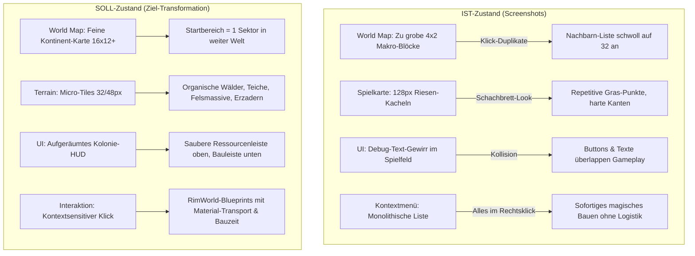
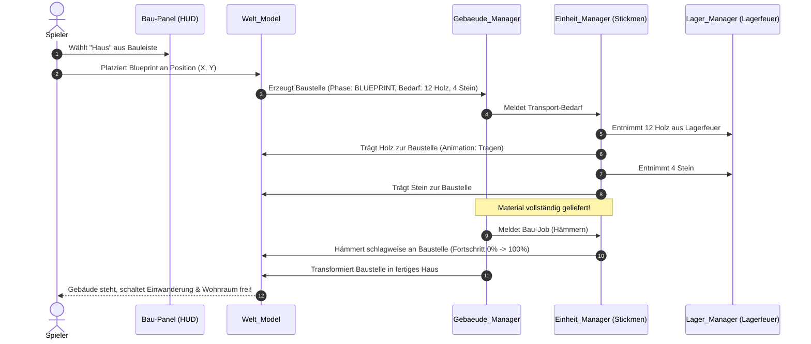

# Vision & Transformations-Roadmap: Vom Kachel-Raster zum lebendigen Bilderbuch-Spiel

Dieses Dokument analysiert die 5 übermittelten Ingame-Screenshots, diagnostiziert die aktuellen Schwachstellen und definiert die exakte Architektur für die Transformation von **SnipWarfare** zu einem immersiven, RimWorld-ähnlichen Kolonie-Simulationsspiel im lebendigen Scherenschnitt-/Bilderbuch-Stil.

---

## 1. Bild-für-Bild-Analyse der 5 Screenshots (IST-Diagnose)

### Screenshot 1 & 2 (World Map):
- **Befund:** Die World Map besteht aktuell nur aus wenigen riesigen Blöcken (4x2 Regionen). Der Startbereich nimmt fast ein Viertel der sichtbaren Welt ein.
- **Problem:** Es entsteht kein Gefühl eines großen Kontinents. Zudem trat der Behoben-Bug auf, bei dem die Nachbarnliste bei jedem Klick erneut angehängt wurde ("Direkte Nachbarn: 32").
- **Lösung:** Verfeinerung des World-Map-Rasters (mindestens 16x12 oder 24x16 Regionen), damit der gewählte Startbereich ein echter, kleiner Lokalausschnitt in einem großen geopolitischen Gefüge mit weiten Wegen und natürlichen Barrieren (Gebirge, Ozeane) ist.

### Screenshot 3 & 5 (Terrain, Assets & Kacheleindruck):
- **Befund:** Riesige 128x128 Pixel Kacheln mit abgerundeten Ecken und sich wiederholenden Grasbüscheln. Harte Schnittkanten zwischen Gemäßigt (hellgrün) und Steppe (gelbgrün).
- **Problem:** Das Spielfeld wirkt wie ein Schachbrett / eine Kachelsammlung und nicht wie eine organische Welt. Es fehlen Teiche, Bäche, Felswände, Erzadern, dichte Waldmassive und Ruinen. Assets wie Bäume und Büsche wirken isoliert auf Kacheln gepflanzt.
- **Lösung:** Umstellung auf kleinere Grundkacheln (32px oder 48px), organische Geländeschichten (Wasserläufe, Felsmassive als abbaubare Wände) und zusammenhängende Baumkronen-Cluster im Paper-Cut-Bilderbuchstil.

### Screenshot 4 (UI, Menüs & Debug-Überlagerung):
- **Befund:** 
  1. Riesiger grüner Debug-Text (`> Einheit 0 - mensch`, `Job: keiner...`, `> Tiere: 4...`) liegt mitten über der Spielwelt und kollidiert mit Buttons.
  2. Der Rechtsklick öffnet ein gigantisches Menü mit **allen** Aktionen (Lagerfeuer bauen, Haus bauen, Werkstatt, Sammeln, Abbauen), egal worauf geklickt wurde.
  3. Gebäude entstehen aktuell sofort ohne Bauphase oder Materialtransport.
- **Problem:** Immersion wird zerstört; Bauen gehört in ein HUD-Baupanel; der Rechtsklick muss wissen, was unter dem Cursor liegt.
- **Lösung:** 
  - Bauen wandert in eine **Bauleiste am unteren Bildschirmrand**.
  - Rechtsklick wird **kontextsensitiv** (Baum -> Fällen, Stein -> Abbauen, Boden -> Laufen, Baustelle -> Priorisieren).
  - Debug-Texte wandern in ein einklappbares Debug-Panel (F3/Tab).

---

## 2. Die RimWorld-ähnliche Spielschleife

### A. Ankunft & Lagerfeuer als Basis-Anker
1. **Spielstart:** Die Siedler (Stickmen) erscheinen am **Lagerfeuer** (dem Ankunftspunkt / temporären Startlager).
2. **Startressourcen:** Das Lagerfeuer hält den ersten Startvorrat (z.B. 20 Holz, 10 Beeren, 5 Stein, 1 Werkzeug) physisch an seinem Standort.
3. **Wärme & Schutz:** Das Feuer spendet im Radius Wärme gegen die Kälte der Nacht und dient als Sammelpunkt für unbeschäftigte Siedler.

### B. Das Blueprint- & Baulogistik-System

---

## 3. Kontextsensitive Steuerung & UI-Architektur

### A. Trennung von Bauen und Kontextaktionen
| Eingabe / Klickziel | Aktion | Verhalten |
| :--- | :--- | :--- |
| **Klick auf Bauleiste (unten)** | Gebäude-Auswahl | Aktiviert Blueprint-Geisterbild am Cursor zum Platzieren |
| **Rechtsklick auf freien Boden** | Gehe hierhin | Bewegt ausgewählte Einheit(en) zum Zielpunkt |
| **Rechtsklick auf Baum** | Holz fällen | Vergibt Holzfäller-Job (Axt schwingen, Baum fällt zu Stumpf) |
| **Rechtsklick auf Busch** | Beeren sammeln | Vergibt Sammler-Job (Pflücken, Beeren landen im Inventar) |
| **Rechtsklick auf Fels / Erzberg** | Stein / Erz abbauen | Vergibt Bergmann-Job (Spitzhacke, Fels baut sich schrittweise ab) |
| **Rechtsklick auf Tier / Beute** | Jagen | Jäger verfolgt Tier, erlegt es und bringt Fleisch ins Lager |
| **Rechtsklick auf Blueprint** | Bauen priorisieren | Zuweisung einer freien Einheit zum Materialtransport / Bau |

### B. Aufgeräumtes HUD-Layout
- **Obere Leiste (Ressourcen-HUD):** Kompakte Papier-Plakette mit Holz, Stein, Fleisch, Beeren, Werkzeug, Siedlerzahl und Tageszeit/Temperatur.
- **Untere Leiste (Bau- & Aktionspanel):**
  - Tabs: *Basis* (Lagerfeuer, Zelt), *Wohnen* (Haus, Großhaus), *Produktion* (Werkstatt, Räucherei), *Zonen* (Lagerzone, Abwurfzone).
  - Klick auf ein Icon öffnet den Blueprint-Platziermodus mit Baukosten-Tooltip.
- **Auswahl-Karte (unten links):** Zeigt Profil der gewählten Einheit (Name, Beruf, Gesundheit, Hunger-Status, Gedankenblase) oder des gewählten Objekts.

---

## 4. Grafik-, Terrain- und Bilderbuch-Pipeline

### A. Geografische Differenzierung & Landschaftselemente
1. **Wasser & Teiche:**
   - Echte Wasserflächen mit polygonalen/organischen Ufern (keine harten Kachelquadrate).
   - Schilfgras, Enten, schwimmende Vögel und Trinkplätze für Tiere.
2. **Berge & Felsmassive (Abbaubar):**
   - Mehrschichtige Felswände im Paper-Cut-Look (Hintergrundkante, Steinstufen, Geröll).
   - Enthalten sichtbare Erzadern (Eisen, Kupfer, Kohle, Gold).
   - Werden schlagweise Kachel für Kachel abgebaut und hinterlassen Schutt/Stein.
3. **Dichte Wälder:**
   - Große organische Waldflächen mit überlappenden Baumkronen in unterschiedlichen Höhen.
   - Unterholz, Farne, Pilze und Beerensträucher am Waldrand.
4. **Strukturen & Ruinen:**
   - Alte Steinkreise, verlassene Karren oder verfallene Holzhütten als Start-Erkundungspunkte.

---

## 5. Konkreter 4-Phasen-Transformationsplan

### Phase 1: UI-Entrümpelung & Kontextsensitiver Rechtsklick
- Debug-Text aus dem Viewport verbannen (in einklappbares Debug-Panel).
- Kontextmenü kontextsensitiv machen: Rechtsklick prüft Objekt unter Cursor.
- Bauaktionen aus dem Rechtsklick entfernen und in vorläufige untere Bauleiste verschieben.

### Phase 2: Blueprint- & Baulogistik-System (RimWorld-Style)
- `Gebaeude_BauMaschine` um Phase `BLUEPRINT` und `MATERIAL_LIEFERUNG` erweitern.
- Blueprint-Darstellung (halbtransparentes Geistergebäude mit Materialbedarfs-Balken).
- Transport-Job: Siedler tragen Holz/Stein vom Lagerfeuer zur Baustelle, bevor gehämmert wird.

### Phase 3: Feine World Map & Ankunfts-Loop
- World-Map-Auflösung auf 16x12 Regionen verfeinern (Startbereich ist kleiner Sektor).
- Start-Lagerfeuer mit verortetem Startbestand (Material + Nahrung).

### Phase 4: Bilderbuch-Terrain, Micro-Tiles & Landschafts-Assets
- Reduktion der Kachelgröße auf 32px/48px mit organischen Clustern.
- SVG-Assets für Wasserflächen/Teiche, Felswände/Berge, Erzadern und Ruinen.
- Nahtlose Terrain-Übergänge im Scherenschnitt-Stil.
